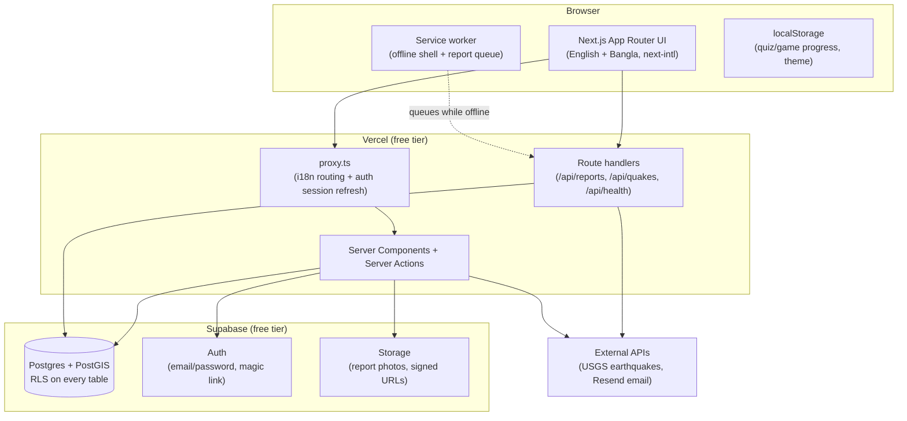

# Surokkha BD (সুরক্ষা)

Free, bilingual (English default, full Bangla support) web app that helps people in
Bangladesh prepare for, survive, and recover from natural disasters -- 14 hazards, a live
map, community reporting, relief coordination, volunteer matching, and a learning layer.
Built solo, $0 infrastructure budget, toward pitching an NGO for a pilot.

> **Not an official warning system.** Always follow alerts from the Bangladesh
> Meteorological Department (BMD) and the Department of Disaster Management (DDM).

**Status:** Phases 1-6 built. Phases 3, 4, and 5 have **not yet been tested against a live
Supabase project** -- see `docs/memory.md`'s session log for why, and run the combined test
checklist before treating anything here as verified. See [`docs/phases.md`](docs/phases.md)
for the full phase-by-phase task list and the Case Study section below for the portfolio
narrative.

## Architecture



## Stack

Next.js 16 (App Router, TypeScript) · Tailwind CSS 4 · next-intl · Supabase (Postgres +
PostGIS + Auth + Storage + RLS) · Leaflet · Resend (email) · Fontsource fonts · deployed on
Vercel. No analytics, no ad trackers, no paid services -- everything runs on free tiers.

## Run locally (Windows, PowerShell)

```powershell
npm install
copy .env.example .env.local     # then fill in Supabase + Resend values
npm run dev                      # http://localhost:3000  (Bangla: /bn)
```

Checks used before every commit:

```powershell
npm run lint
npm run typecheck
npm run build
```

## Project layout

```
docs/                  prd, architecture, design, rules, phases, memory, security review
src/app/[locale]/      pages (English at /, Bangla at /bn)
src/app/api/           route handlers (reports, quakes, health)
src/app/robots.ts      robots.txt
src/app/sitemap.ts     sitemap.xml with bilingual alternates
src/components/        shared UI components
src/i18n/               next-intl routing and request config
src/lib/                helpers (supabase clients, hazards, relief, volunteers, badges...)
src/messages/           en.json (source) and bn.json
src/content/hazards/    bilingual hazard content (14 hazards, JSON)
src/content/legal/      privacy policy / terms content (draft, needs legal review)
src/content/contacts.json  emergency numbers (bilingual, sourced, dated)
src/proxy.ts            locale routing + auth session refresh (Next.js 16 "proxy")
public/sw.js            minimal offline service worker
public/manifest.webmanifest  PWA manifest
supabase/migrations/    schema + RLS, 0001 through 0010, run in order
supabase/seed/          seed data (districts, shelters, historical events, quiz, ferries)
.github/workflows/      Supabase keep-alive cron (redundant with Vercel's)
vercel.json             Vercel cron config (keep-alive)
```

## Feature map

| Area | Pages | Notes |
|---|---|---|
| Knowledge core | `/`, `/hazards`, `/hazards/[slug]`, `/contacts`, `/plan` | Works offline after first visit |
| Map & shelters | `/map`, `/shelters` | Live shelters table + USGS earthquakes (30 days) |
| Community | `/report`, `/login`, `/signup`, `/account` | Photo + map pin, honeypot + rate-limited |
| Admin | `/admin/*` | Alerts, shelters, reports, relief, volunteers, ferries, audit log |
| ReliefLink | `/relief`, `/relief/[id]` | Public need board, pledges, de-identified activity log |
| Volunteer Hub | `/volunteer` | Skill/district profile, task board, apply/accept flow |
| Learning | `/explorer`, `/quiz`, `/games`, `/progress`, `/teacher` | Sourced historical data, quizzes from vetted content, 2 mini-games, printable worksheets |
| Remote access | `/lite`, `/ferries` | Text-only mode, ferry board + help requests |
| Legal | `/privacy`, `/terms` | **Draft, not lawyer-reviewed** -- see file headers |
| Portfolio | `/case-study` | The narrative version of this README |

## Supabase setup

Run every file in `supabase/migrations/` **in order** (0001 through 0010), then every file
in `supabase/seed/`. **Every file is safe to run again**: policies are dropped and recreated,
and seed files skip rows that already exist (verified by running all of them three times in a
row on PostgreSQL 16 + PostGIS against a stand-in for Supabase's `auth`/`storage` schemas --
not on Supabase itself). If you ran the *old* seed files twice and have duplicate rows, run
`supabase/maintenance/dedupe_seed_rows.sql` once. Fill in `.env.local` (copy `.env.example`) with your project's URL,
anon/publishable key, and service role key, plus `RESEND_API_KEY` for email notifications.

**Deploying to Vercel:** add the same env vars in Project Settings -> Environment Variables.
Without them, the build fails, since several routes need Supabase reachable to build as
dynamic routes.

**Test accounts:** sign up normally through `/signup` for a `citizen` account. To test
coordinator/admin features, sign up, then manually change that user's `role` in the
`profiles` table via the Supabase Table Editor or SQL editor -- there is deliberately no way
to grant yourself a higher role through the app itself (and migration `0010` closes a real
bug that used to make this possible; see `docs/SECURITY_REVIEW.md`).

**Keep-alive:** Supabase free-tier projects pause after ~7 days of inactivity. `vercel.json`
pings `/api/health` daily (the max frequency Vercel's free Hobby cron allows), and
`.github/workflows/keepalive.yml` pings it again twice a week as a redundant backup -- see
that file's comments for why two mechanisms.

See [`supabase/tests/manual_rls_checklist.md`](supabase/tests/manual_rls_checklist.md) for a
step-by-step way to confirm each role can and can't do what it should.

## Content and data review needed before a real launch

Nothing here should be presented as authoritative yet:

- Hazard guide text and emergency numbers were AI-drafted and are not yet verified against
  official BMD/DDM/FFWC publications. Each hazard page shows a draft notice until its
  `status` field is set to `"reviewed"` in `src/content/hazards/*.json`.
- Historical disaster data (`supabase/seed/0003_seed_historical_events.sql`) is sourced from
  public secondary sources (Wikipedia, ReliefWeb, GFDRR, Banglapedia) with citations and
  noted discrepancies -- not primary BMD/DDM/BBS figures.
- Ferry schedule times (`supabase/seed/0005_seed_ferry_schedules.sql`) are explicitly marked
  unverified -- real routes, unconfirmed times.
- All Bangla content is first-pass AI translation, not reviewed by a native speaker.
- The privacy policy and terms (`src/content/legal/`) are drafts, not legal advice.

Full list, with what's needed to close each one, in `docs/memory.md` section 5 (Open
Content Questions).

## Security

See [`docs/SECURITY_REVIEW.md`](docs/SECURITY_REVIEW.md) for the Phase 6 security review:
what was checked, two real bugs found and fixed (including a privilege-escalation issue),
and what's still open (a nonce-based CSP, and anything that needs a live environment or a
human to verify).

## Health check

`GET /api/health` returns app status and whether Supabase is reachable. Also used as the
keep-alive ping (see above).

## Human-only Phase 6 work

Four Phase 6 tasks need a human and/or physical hardware and could not be done from an AI
coding session: a full accessibility audit (axe + NVDA + keyboard), a Lighthouse
performance pass, testing on a real low-end Android phone, and native-speaker/subject-expert
content review. See [`docs/PHASE6_HUMAN_CHECKLIST.md`](docs/PHASE6_HUMAN_CHECKLIST.md) for
exactly what to do for each.

## Before a demo

See [`docs/PRE_DEMO_CHECKLIST.md`](docs/PRE_DEMO_CHECKLIST.md).

## Case study

`/case-study` (and its Bangla translation at `/bn/case-study`) is the portfolio-facing
narrative of this project: the problem, the approach, the technical decisions worth calling
out, and an honest account of what's still open. Written to be read by someone evaluating
this as a portfolio piece, not just a user of the app.

## Before you code

Read `docs/memory.md`, `docs/rules.md`, and `docs/phases.md` -- in that order.
